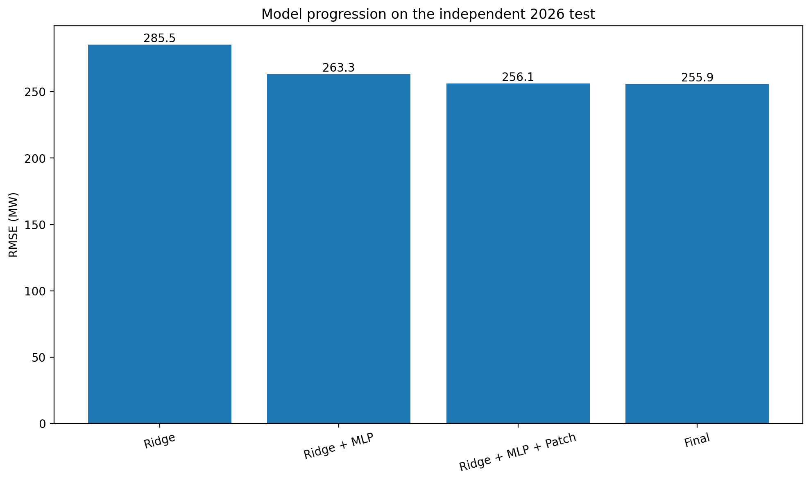
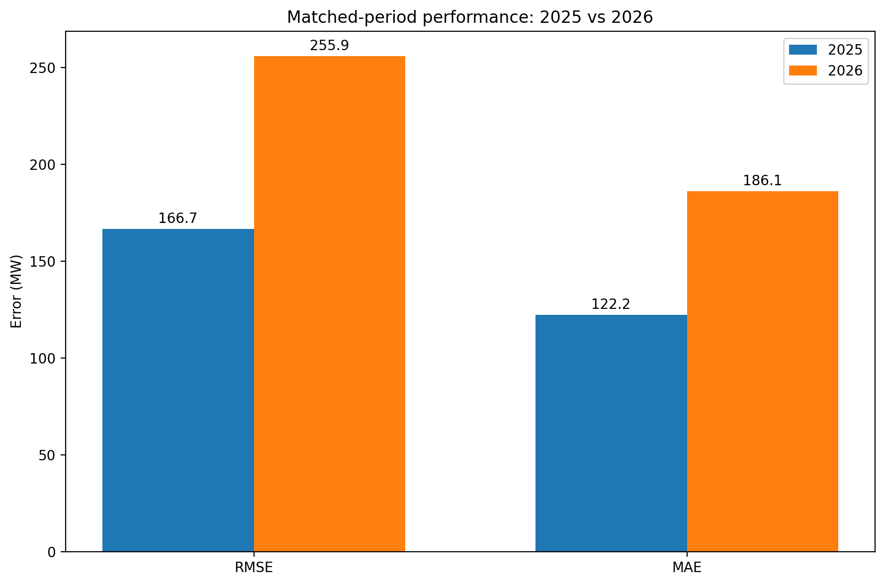
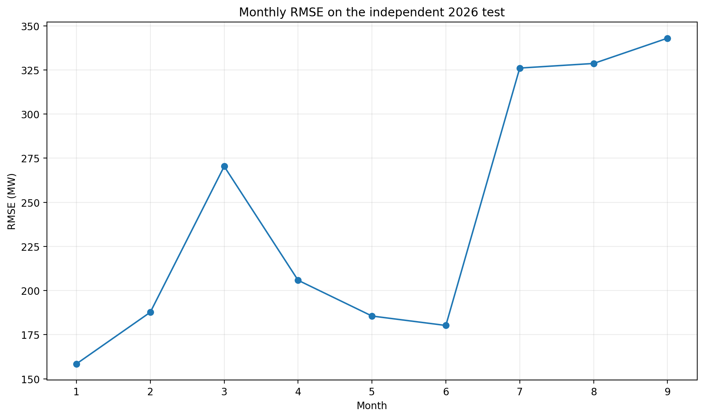
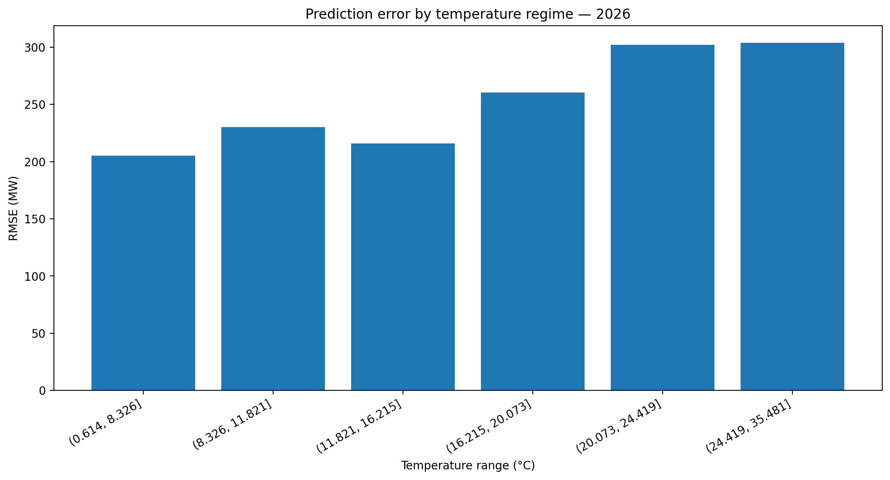
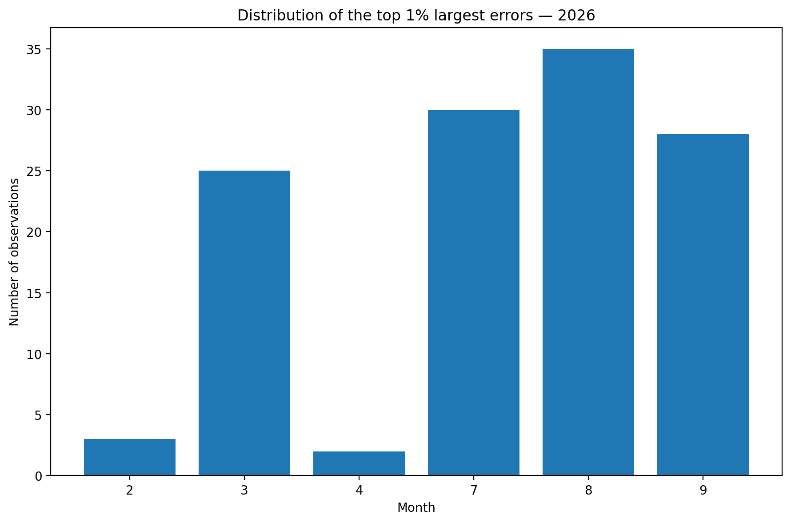

# Energy Consumption Forecasting

## Overview

Ce projet développe un pipeline complet de prévision de consommation électrique combinant statistique en grande dimension, machine learning, deep learning, séries temporelles et analyse de drift.

L'objectif est de prédire la consommation électrique à partir de l'historique de consommation, de variables calendaires et de données météorologiques.

Une attention particulière est portée à la validation temporelle. Le modèle final est évalué sur des données futures de 2026 totalement indépendantes des phases d'entraînement, de validation et de sélection des modèles.

## Project Status

This repository is an experimental Data Science and Machine Learning project.

Its main objective is to explore, compare and combine a broad range of statistical, machine learning, deep learning and MLOps techniques on an energy forecasting problem.

The project was developed as a technical experimentation environment rather than as a fully production-ready application.

Some notebooks therefore contain exploratory code, intermediate experiments and alternative modeling approaches that were intentionally kept to document the development process.

The final objective is not to provide a perfectly cleaned software package, but to demonstrate an end-to-end modeling workflow including feature engineering, model selection, uncertainty quantification, deep learning, temporal validation, drift analysis and initial deployment experiments.

## API & MLOps

The project also includes an experimental FastAPI service connected to PostgreSQL.

Main endpoints:

- `GET /health`
- `GET /database/health`
- `GET /model/metrics`
- `GET /prediction`
- `GET /predictions`
- `GET /predictions/chart`

The API was tested locally with the PostgreSQL database used during development.

### Run locally

Set the PostgreSQL password:

'''powershell
$env:POSTGRES_PASSWORD = "your_password"

# Final Model

Le modèle final est un pipeline hybride composé de quatre niveaux :

1. Ridge Regression
2. Residual MLP
3. Patch Transformer
4. Refined Event Expert

Le Ridge capture la structure linéaire principale de la consommation.

Le Residual MLP apprend ensuite à corriger les erreurs résiduelles du Ridge.

Le Patch Transformer exploite la structure temporelle des résidus sur des séquences de 336 observations, soit environ une semaine de données à fréquence 30 minutes.

Enfin, un Refined Event Expert est activé sur certains événements calendaires particuliers, notamment les jours fériés, certaines périodes de fin d'année et les lendemains de jours fériés.

La prédiction finale peut être résumée comme :

Prediction finale = Ridge + correction MLP + correction Patch Transformer + correction Event Expert

# Feature Engineering

Le modèle final utilise 429 variables explicatives.

Les principales familles de variables sont :

- retards de consommation de lag_1 à lag_336 ;
- retards saisonniers à plus long terme ;
- moyennes glissantes ;
- écarts-types glissants ;
- tendances de court, moyen et long terme ;
- différences journalières et hebdomadaires ;
- variables calendaires ;
- encodages cycliques de l'heure, du jour et du mois ;
- données météorologiques ;
- interactions non linéaires avec la température.

Exemples de variables météorologiques :

- temp_lag_1h
- temp_lag_24h
- temp_lag_7d
- temp_mean_24h
- temp_mean_7d
- heating_degree
- cooling_degree
- temp_squared
- temp_cubic

# Experimental Protocol

Le projet utilise une séparation temporelle stricte.

Les données 2026 constituent le jeu de test final indépendant.

Elles n'ont pas été utilisées pour :

- entraîner les modèles ;
- sélectionner les architectures ;
- régler les hyperparamètres ;
- sélectionner les coefficients de combinaison ;
- choisir les règles d'activation de l'Event Expert.

Le pipeline complet a été gelé avant l'évaluation finale sur les données 2026.

Cette procédure permet d'obtenir une estimation plus réaliste de la capacité du modèle à généraliser sur des données futures.

# Independent 2026 Test

La période de test finale couvre le 15 janvier 2026 au 26 septembre 2026.

Nombre d'observations : 12 239.

| Model | RMSE (MW) | MAE (MW) | MAPE | NRMSE | R2 |
|---|---:|---:|---:|---:|---:|
| Ridge | 285.53 | 208.88 | 0.4480 % | 0.5899 % | 0.9990 |
| Ridge + MLP | 263.31 | 193.06 | 0.4134 % | 0.5440 % | 0.9991 |
| Ridge + MLP + Patch Transformer | 256.13 | 186.30 | 0.3994 % | 0.5292 % | 0.9992 |
| Final model | 255.91 | 186.11 | 0.3988 % | 0.5287 % | 0.9992 |

Le modèle final réduit le RMSE de 10.38 % par rapport au Ridge de référence.

Le MAPE final est de 0.3988 %, ce qui signifie que l'écart absolu entre la prédiction et la consommation réelle représente en moyenne environ 0.40 % de la consommation observée.

# Temporal Generalization

Pour mesurer la stabilité temporelle du modèle, les performances 2025 et 2026 ont été comparées sur exactement la même fenêtre calendaire : du 15 janvier au 26 septembre.

Les deux périodes contiennent 12 239 observations.

| Metric | 2025 | 2026 | Change |
|---|---:|---:|---:|
| RMSE | 166.69 MW | 255.91 MW | +53.53 % |
| MAE | 122.17 MW | 186.11 MW | +52.33 % |
| MAPE | 0.2565 % | 0.3988 % | +55.48 % |
| NRMSE | 0.3426 % | 0.5287 % | +54.34 % |
| P95 absolute error | 312.30 MW | 508.26 MW | +62.75 % |
| P99 absolute error | 487.28 MW | 827.68 MW | +69.86 % |

Ces résultats montrent une dégradation importante de la généralisation temporelle en 2026.

L'augmentation est particulièrement forte dans la queue de la distribution des erreurs.

# Error Analysis

L'analyse des erreurs montre que la dégradation observée en 2026 n'est pas uniforme.

Les périodes les plus difficiles sont principalement :

- juillet ;
- août ;
- septembre ;
- le milieu de journée et l'après-midi ;
- les week-ends ;
- les températures élevées.

Le mois de septembre présente le RMSE mensuel le plus élevé avec environ 342.98 MW.

À 12 h, le RMSE atteint environ 347.70 MW.

Le dimanche est le jour de la semaine le plus difficile avec un RMSE d'environ 282.77 MW.

Pour les températures supérieures à environ 24.4 °C, le RMSE atteint environ 303.78 MW.

Les mois de juillet, août et septembre regroupent également environ 75.6 % des observations appartenant aux 1 % d'erreurs absolues les plus importantes.

# Drift Analysis

Une analyse de drift a été réalisée afin de comprendre la dégradation observée entre 2025 et 2026.

Sur les 429 variables explicatives :

- 413 présentent un drift faible ;
- 13 présentent un drift modéré ;
- 3 présentent un drift important.

Environ 3.73 % des variables présentent donc un drift modéré ou important.

Les principaux changements concernent notamment :

- temp_mean_7d
- temp_mean_24h
- rolling_mean_336
- rolling_std_336
- cv_week

La distribution globale de la consommation reste relativement stable entre 2025 et 2026.

Cela indique la présence d'un covariate shift localisé plutôt que d'un changement massif de l'ensemble des variables.

# Multivariate Matching

Afin de déterminer si les performances se dégradent encore lorsque les observations 2025 et 2026 présentent des caractéristiques similaires, un matching multivarié a été réalisé.

Le matching utilise simultanément des informations concernant :

- la consommation passée ;
- les moyennes glissantes ;
- les écarts-types glissants ;
- la température ;
- l'heure ;
- le jour de la semaine ;
- la saisonnalité.

L'analyse la plus stricte utilise 122 paires de mutual nearest neighbors.

| Metric | 2025 | 2026 | Change |
|---|---:|---:|---:|
| RMSE | 269.13 MW | 230.20 MW | -14.46 % |
| MAE | 162.87 MW | 169.36 MW | +3.99 % |

Dans 53.28 % des paires, l'erreur absolue est plus importante en 2026.

Le matching multivarié ne montre donc pas une dégradation systématique lorsque plusieurs caractéristiques sont contrôlées simultanément.

La conclusion la plus rigoureuse est la suivante :

- forte dégradation de généralisation temporelle ;
- covariate shift localisé ;
- indices de drift conditionnel ;
- pas de preuve suffisante permettant d'affirmer qu'un concept drift est démontré.

  # Final Figures

## Model progression on the independent 2026 test

## Temporal generalization: 2025 vs 2026

## Monthly RMSE in 2026

## Error by temperature regime

## Extreme errors by month

  # Conclusion

Ce projet met en place un pipeline hybride de prévision de consommation électrique combinant statistique, machine learning et deep learning.

Le modèle final associe Ridge Regression, Residual MLP, Patch Transformer et Refined Event Expert.

Sur le test indépendant 2026, le modèle atteint :

- RMSE : 255.91 MW
- MAE : 186.11 MW
- MAPE : 0.3988 %
- NRMSE : 0.5287 %
- R2 : 0.9992

Le pipeline complet réduit le RMSE de 10.38 % par rapport au Ridge de référence.

L'évaluation sur des données futures met également en évidence une dégradation importante de la généralisation temporelle entre 2025 et 2026.

L'analyse détaillée montre un covariate shift localisé ainsi qu'une concentration des erreurs dans certains régimes, notamment les températures élevées, les mois d'été, le milieu de journée et les week-ends.

Le projet illustre ainsi l'importance de ne pas seulement optimiser un modèle sur une période historique, mais également d'évaluer sa robustesse sur des données réellement futures.

## Reproducibility

The final 2026 dataset was kept completely independent from model training, model selection and hyperparameter tuning.

Intermediate trained models and large processed datasets are not stored directly in this repository because of their size.

The notebooks document the complete methodology, feature engineering, model development, validation protocol and final independent evaluation.

---

## Interactive Streamlit Dashboard

An interactive Streamlit dashboard is included to explore model performance and temporal generalization.

### Features

- Development / validation analysis for 2025
- Read-only independent final test for 2026
- Real electricity demand vs model predictions
- RMSE, MAE, MAPE, NRMSE and R²
- Error distribution and extreme error analysis
- Model progression:
  - Ridge
  - Ridge + residual MLP
  - Patch Transformer
  - Refined Event Expert
- Historical comparison between 2025 and 2026
- Custom period selection

The 2026 results correspond to the frozen independent final test set.
They are displayed for analysis only and are not used for training,
hyperparameter tuning or model selection.

### Run the API

The 2025 development data are exposed through FastAPI and PostgreSQL.

'''powershell
$env:POSTGRES_PASSWORD = "your_postgresql_password"
py -3.11 -m uvicorn api.main:app --reload --port 8000
